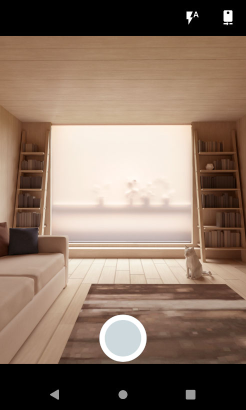
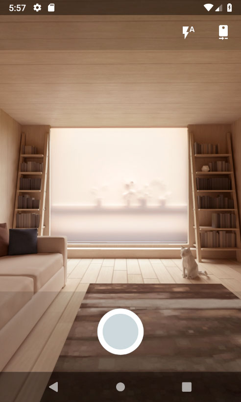

# PhotoBarcode
Easy to use library to take picture or scanning barcodes in the Android application.

[](https://jitpack.io/#ivan200/PhotoBarcode)

## Dependency

Add this in your root `build.gradle` file (**not** your module `build.gradle` file):

```gradle
allprojects {
	repositories {
        maven { url "https://jitpack.io" }
    }
}
```

Then, add the library to your module `build.gradle`
```gradle
dependencies {
    implementation 'com.github.ivan200:PhotoBarcode:1.0.3'
}
```

# Usage

## To taking picture
```java
fabPicture.setOnClickListener(view -> {
    final PhotoBarcodeScanner photoBarcodeScanner = new PhotoBarcodeScannerBuilder()
            .withActivity(this)
            .withTakingPictureMode()
            .withPictureListener(file -> {
                imageView.setImageURI(Uri.fromFile(file));
            })
            .build();
    photoBarcodeScanner.start();
});
 ```
 
## To scan a barcode
```java
fabBarcode.setOnClickListener(view -> {
    final PhotoBarcodeScanner photoBarcodeScanner = new PhotoBarcodeScannerBuilder()
            .withActivity(this)
            .withResultListener((Barcode barcode) -> {
                textView.setText(barcode.rawValue);
            })
            .build();
    photoBarcodeScanner.start();
});
 ```
That's it!

## Or you can customize the builder with a lot more options:
Additional parameters with default values:

Flags for both modes:
```java
.withCameraFullScreenMode(false)       //Mode of camera preview: FullScreen - 16/9 with horizontal crop, or otherwise 4/3 with screen fit
.withRequestedFps(25.0f)               //Fps in preview of picture.
.withSoundEnabled(true)                //Enables or disables a sound whenever picture taken or a barcode is scanned
.withAutoFocus(true)                   //Enables or disables auto focusing on the camera
.withFocusOnTap(true)                  //Allow focus picture when user tap on screen
.withFlashLightEnabledByDefault(false) //Enable flash light before open camera 
.withCameraFacingBack(true)            //Use the camera facing back or front
.withCameraLockRotate(true)            //Lock rotate phone and orientation in camera activity (to avoid recreating view)
.withErrorListener(ex->{showAlert()})  //Possibility to customize fatal exceptions occured 
.withMinorErrorHandler(printStackTrace)//Possibility to customize handler of non fatal exceptions
```

Flags for picture mode:
```java
.withTakingPictureMode()             //Activate takingPicture mode instead of taking barcode (barcode mode is default)
.withPreviewImage(true)              //Allow preview image and redo it before it returned
.withPictureListener(Consumer<File>) //Set listener to take picture, file will saved in context.getFilesDir()/photos
.withThumbnails(false)               //In addition to the photo the thumbnail will be saved too (in context.getFilesDir()/thumbnails)
.withCameraTryFixOrientation(true)   //Automatically try to rotate final image by phone sensors
.withImageLargerSide(1200)           //Once the picture is taken, if its too big, it automatically resizes by the maximum side
.withSavePhotoToGallery(String)      //Once the picture is taken, it automatically saved into phone gallery as well (DCIM directory)
                                     //You need to have WRITE_EXTERNAL_STORAGE and READ_EXTERNAL_STORAGE permissions in your manifest file to use it
```

Flags for barcode mode:
```java
.withCenterTracker(false)              //Enables the default center tracker (white square in screen)
.withResultListener(Consumer<Barcode>) //Called immediately after a barcode was scanned
.withText("Scanning...")               //Shows a text message at the top of the barcode scanner
.withTrackerColor(int)                 //Sets the tracker color used by the barcode scanner (default is "#F44336")
.withCenterTracker(int, int)           //Customize center tracker with a custom drawable resource
.withOnly2DScanning()                  //Setup scan only 2D type of barcodes
.withOnly3DScanning()                  //Setup scan only 3D type of barcodes
.withOnlyQRCodeScanning()              //Setup scan only QR-Code barcodes
.withBarcodeFormats(int)               //Bit mask that selects which formats this barcode detector should recognize.
```

## Notice
If you want the library to fully handle requests permissions, 
you need to pass onActivityResult and onRequestPermissionsResult to PhotoBarcodeScanner, for example like this:
```java
@Override
public void onRequestPermissionsResult(int requestCode, @NonNull String[] permissions, @NonNull int[] grantResults) {
    super.onRequestPermissionsResult(requestCode, permissions, grantResults);
    photoBarcodeScanner.onRequestPermissionsResult(requestCode, permissions, grantResults);
}

@Override
protected void onActivityResult(int requestCode, int resultCode, @Nullable Intent data) {
    super.onActivityResult(requestCode, resultCode, data);
    photoBarcodeScanner.onActivityResult(requestCode, resultCode, data);
}
```
Or you can manage permissions by yourself before calling photoBarcodeScanner.start();

## Screenshots


# Developed By

* Zakharov Ivan
* 79067180651@ya.ru
* [Donate with Paypal](https://www.paypal.me/ivanz200)